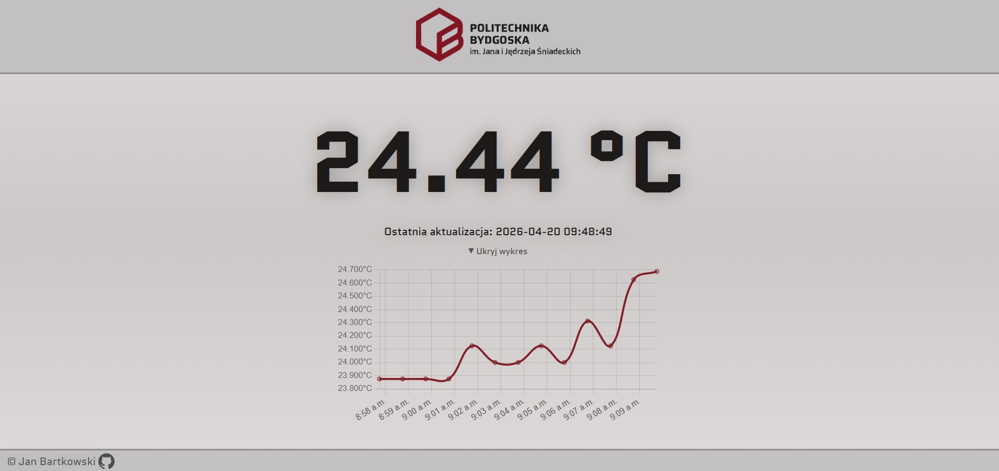

<h1 align="center">pi-temp-pbs</h1>

    
    
    

</a>

Kod stworzony w ramach praktyk zawodowych, na Raspberry Pi 5.

Odczytuje temperaturę z czujnika DS18B20 podłączonego do interfejsu 1-wire, i za pomocą Pythona + Flask wyświetlą ją na frontendzie wraz z godzinnym wykresem z ostatniego dnia.

    

<i>
Zrzut ekranu dashboard
</i>

## Funkcjonalność
- Odczyt **DS18B20** (1-Wire interface)  
- **Realtime dashboard** Flask + Chart.js (24h wykres)
- **Background logging** APScheduler + SQLite
- **Production deployment** nginx + gunicorn + systemd

## Wykorzystane technologie i języki:
- **Python** *(Flask, APScheduler)*
- Vanilla **HTML, CSS, JS** *(Chart.JS)*
- **SQAlchemy, SQLite**
- **TOML** *(plik konfiguracji `config.toml`)*
- **Bash** *(skrypt `deploy.sh`)*
- **nginx**
- **gunicorn**
- **systemd**
